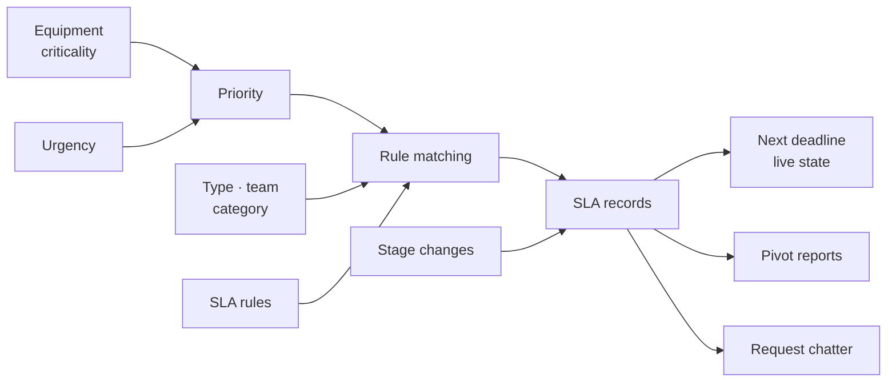
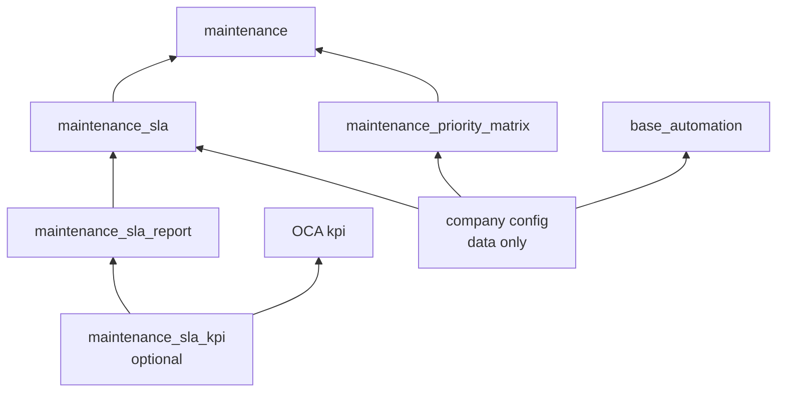
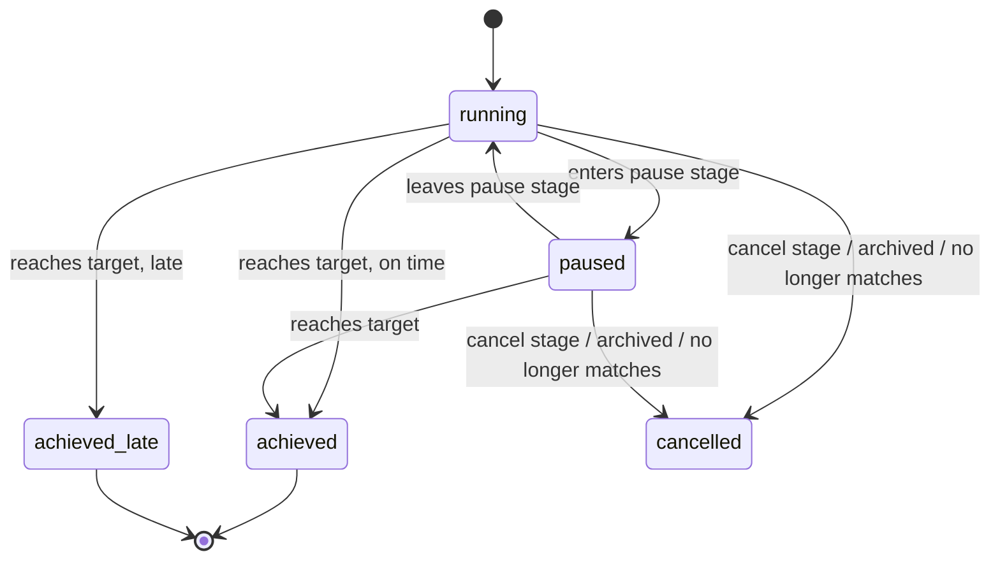

# Maintenance SLA — Core Design

Sep 25, 2026 · @Peter

## 1. Objectives

The SLA system exists to deliver four outcomes for maintenance requests. Anything that does not serve one of them stays out of v1.

| ID | Objective | Why it matters | Achieved when |
| --- | --- | --- | --- |
| O1 | **Consistent commitment.** Every request receives its deadlines at creation from configured rules, proportional to its production impact. | Without a promise there is nothing to measure. Without consistent priority, every request becomes "urgent". | Each open request carries SLA records whose targets come from rules, not from free choice. |
| O2 | **Trustworthy evidence.** Each commitment is recorded separately with its own target, start, stop, pauses and result, and is never rewritten or deleted. | Nobody acts on numbers that shift when settings change or tickets are edited. | Every finished commitment shows when it was reached, how long it took, and whether it was on time. |
| O3 | **Live focus.** Anyone can see which requests are at risk or overdue at any moment. | Breaches are prevented, not just reported. | The request board is sorted by next deadline and coloured by live state. |
| O4 | **Accountability over time.** Compliance and actual times can be reviewed by rule, team, line, priority and month. | Staffing, spares and target decisions need evidence. | A standard pivot shows compliance % and average times. |

The clocks measured are the ones production experiences: **Response** (reported → technician working on the machine) and **Restore** (reported → operation confirmed running again) for corrective requests. Preventive requests use the same rule model with a **Completion** clock (scheduled date → done); its rules are configured after v1.

### Scope of v1

| Capability | v1 | Reason |
| --- | --- | --- |
| Configurable SLA rules, targets and at-risk threshold | In | Core of O1. |
| Priority from criticality × urgency, with logged override | In | Makes targets meaningful (O1). |
| Pause (time in waiting stages excluded) | In | Fair measurement (O2): time spent waiting for parts or for a production window is not the maintenance team's. |
| Restore confirmation by the requester | In | Restore must mean the operation really runs (O2). |
| Waivers | In | Keeps compliance fair without hiding breaches (O2, O4). |
| Preventive rule shape | In (design) | Same model as corrective; rows are configured later. |
| Resolve / closure SLA | Out | Resolution belongs to the nonconformity, not to the request: the request is the event, the nonconformity is the issue. Nothing in the management-system suite carries time targets today, so a closure clock is a separate design using this same rule-and-record shape, not something already in place. |
| Working-hour calendars | Out | A 24/7 clock plus pause stages is simpler and sufficient. |
| Automatic escalation | Out | Configurable later with Automated Actions, no code. |

## 2. Requirements

Twelve requirements meet the four objectives; each traces to at least one.

| ID | Requirement | Serves |
| --- | --- | --- |
| R1 | Priority is computed from equipment criticality (A/B/C, defaulted from the equipment category) and reported urgency (closed list) using a rule table. A maintenance manager may override it; the override is tracked with a reason. | O1 |
| R2 | SLA rules are configurable rows: match conditions (request type, priority, teams, equipment categories, optional domain), clock start, target stage, pause stages, duration and at-risk %. | O1 |
| R3 | On creation, every matching rule creates an SLA record, at most one **open** record per target stage (the rule with the lowest sequence wins). | O1 |
| R4 | When priority, team, equipment category or request type changes, rules are re-matched: newly matching rules create records, open records that no longer match are cancelled, finished records are untouched. | O1, O2 |
| R5 | Each SLA record snapshots its target stage, duration and at-risk %; later edits to the rule do not alter it. | O2 |
| R6 | The clock is 24/7 wall-clock time from the start (reported time for corrective, scheduled date for preventive); time in the rule's pause stages is excluded, and accumulated on the record so that waiting is measurable rather than merely uncounted. | O2, O4 |
| R7 | Reaching the target stage, or any later stage, stops the clock and stores the reached time, the elapsed time and the result (achieved or achieved late). | O2 |
| R8 | A finished record is never reopened. Moving a request back below the target stage leaves it as it stands and opens a **new record** for the same rule — the next cycle — whose clock starts at the moment of the move. | O2 |
| R9 | Reaching a stage flagged as cancel (e.g. Scrap) cancels all open records of the request. | O2 |
| R10 | SLA records are never deleted. A manager may waive a record with a reason; the result stays visible but is excluded from compliance. | O2, O4 |
| R11 | Each request exposes its next deadline and a live state (on track, at risk, overdue) for sorting, colouring and filtering, without a scheduled job. | O3 |
| R12 | SLA records carry grouping dimensions (rule, team, equipment, category, priority, type) and a numeric on-time result for standard pivot reporting. | O4 |

The reported time defaults to creation and may be corrected for late entry until the first clock of the request stops.

## 3. Architecture

The system is delivered as three code modules, an optional glue module and a company configuration module (section 3.1). Its core, `maintenance_sla` (depends on `maintenance` and `mail`), works in three layers: configuration, evidence, and fields on the request. It has no scheduled job and no calendar logic.

| Layer | Contents | Role |
| --- | --- | --- |
| Configuration | SLA rules, priority rules, a cancel flag on stages, criticality on equipment | What is promised, and to which requests |
| Evidence | SLA records, one per request and commitment | What was promised, what happened, the result |
| Request | Urgency, priority, reported time, next deadline, live state | Inputs to matching and the live view |

Five design choices keep it small:

1. **Stages are the event source.** Reaching a stage stops a clock; sitting in a pause stage pauses it. This is the model used by both Odoo Enterprise Helpdesk and OCA `helpdesk_mgmt_sla`, and it reuses the board technicians already work with. No extra buttons or milestone fields.
2. **One flat rule model for all request types.** A rule's target stage defines the clock, so Response, Restore and preventive Completion are rows, not code.
3. **Evidence is separate from the request.** SLA records snapshot their targets and are never deleted, so results survive ticket and configuration changes.
4. **Work happens at write time.** Records are created, re-matched and updated on create and on writes to stage, priority, team, category or type. The live state is computed on read with a search method.
5. **24/7 arithmetic.** Every duration is a datetime subtraction.



Matching decides which commitments exist; stage changes move each commitment through its states; everything else reads the records.

### 3.1 Module structure

Each module has a functional purpose on its own, and dependencies run one way only.

| Module | Contents | Depends on | Stands alone because |
| --- | --- | --- | --- |
| `maintenance_priority_matrix` | Criticality on equipment and category, urgency, priority rules, priority override with reason | `maintenance` | Consistent priority is valuable without any SLA. The SLA core reads only the native `priority` field, so it does not depend on this module. |
| `maintenance_sla` | SLA rules, SLA records, stage logic, live state, kanban ordering, waivers, chatter posts | `maintenance`, `mail` | The commitment and evidence engine; everything else builds on it. |
| `maintenance_sla_report` | Pivot and graph actions, reporting menus, the stored grouping dimensions on SLA records (section 4.3) | `maintenance_sla` | Reporting evolves on its own schedule and can be restricted to managers. |
| `maintenance_sla_kpi` (optional) | Predefined headline KPIs over SLA records | `maintenance_sla_report`, OCA `kpi` | Glue module, installed only if OCA `kpi` is adopted. |
| `<company>_maintenance_sla_config` (data only) | Stages and their SLA flags, SLA rules, priority rule rows, escalation Automated Actions | `maintenance_sla`, `maintenance_priority_matrix`, `base_automation` | Keeps company-specific configuration out of the generic code, so it can be reset or migrated separately and the code modules stay reusable. |



Arrows point from a module to what it depends on. Waivers, pause handling and preventive support stay inside `maintenance_sla`: they are part of the clock's integrity or pure configuration, and would have no purpose as separate modules.

### 3.2 Fit with this instance

Checked against the running code and database on 2026-09-29; the two override rows refreshed on 2026-10-01, after `maintenance_priority_matrix` was installed. These are the facts the implementation may rely on; re-check them after any OCA pull.

| Fact | Consequence for the code |
|---|---|
| No installed model has `sla` in its name, and none of `maintenance_sla`'s field names exists on `maintenance.request`, `.equipment`, `.equipment.category`, `.stage` or `.team`. `maintenance_priority_matrix` now owns `criticality`, `urgency`, `priority_suggested` and `priority_reason` (section 4.4's priority rows) | Nothing to rename or defend against |
| **One installed module overrides `write()` on `maintenance.request`: `maintenance_priority_matrix`**, which reads `priority` and `priority_suggested` before `super()` and afterwards writes `priority` when the suggestion moved | The SLA hook calls `super()` first, then reads `stage_id` and the matching inputs from the records. A priority set by the matrix arrives as a nested `write()` and re-enters the hook, so re-matching must be safe to run twice |
| Two override `create()`: `maintenance_request_sequence`, to stamp `code` from a sequence, and `maintenance_priority_matrix`, which fills `priority` from the suggestion **after** `super().create()`, through a `write()` | Matching runs after `super().create()`, so the record already has its code and stage. Depending on load order, the matrix's `write()` reaches the SLA hook either inside `super().create()` — before the SLA's own matching — or after it; matching has to produce the same records either way |
| Nothing in the installed stack writes `stage_id` behind the engine's back | Stage transitions are observable in one place |
| `maintenance.request` inherits `mail.thread.cc` and `mail.activity.mixin` | Chatter posts and future activities need no mixin of ours |
| `_check_access(self, operation) -> tuple \| None` exists in this core (`odoo/models.py:4464`) | The delegation in section 4.3 is valid here, not only in the helpdesk module it comes from |
| `maintenance_plan` sets both `request_date` and `schedule_date` on every generated request, from a date | A preventive clock always has a start; it begins at midnight of the due day, which is what "allowed lateness" counts from |
| The instance runs four stages, sequences 1–4, all distinct | Resequencing for section 5.4 touches no ids and loses no links |
| `maintenance_plan_only` forces `recurring_maintenance = False` | Core's copy-on-recurrence path is dormant; `copy=False` is still required for the UI's Duplicate action |

## 4. Data model

Two new configuration models, one new evidence model, and small additions to existing maintenance models.

### 4.1 `maintenance.sla` (SLA rule)

One row is one commitment, e.g. "P3 · Response · reach *In progress* · 0:15".

| Field | Type | Notes |
| --- | --- | --- |
| `name`, `sequence`, `active`, `company_id` | Char, Integer, Boolean, Many2one | Lower sequence wins when two matching rules share a target stage. |
| `maintenance_type` | Selection: `corrective`, `preventive` | Required. |
| `priority` | Selection `0`–`3`, optional | Empty = any priority. |
| `team_ids` | Many2many `maintenance.team` | Empty = any team. |
| `equipment_category_ids` | Many2many `maintenance.equipment.category` | Empty = any category. |
| `domain` | Char (domain), optional | Extra filter on the request for cases the fields above do not cover. |
| `start_from` | Selection: `reported`, `scheduled` | Clock start: `reported_at` or `schedule_date`. |
| `target_stage_id` | Many2one `maintenance.stage` | Reaching this stage, or any later one by sequence, stops the clock. Cannot be a cancel stage. |
| `pause_stage_ids` | Many2many `maintenance.stage` | Time spent in these stages is not counted. |
| `duration` | Float, hours (`float_time` widget) | The target. Label it **Target (hours)** in every view: `maintenance.request.duration` already exists in core as a manual estimate used for calendar and gantt display, and the two will sit near each other in reports. |
| `at_risk_pct` | Integer, default 75 | Share of the duration after which the record is at risk. |

### 4.2 Priority and criticality

| Model | Field(s) | Notes |
| --- | --- | --- |
| `maintenance.sla.priority.rule` (new) | `criticality`, `urgency`, `priority` | One row per combination (15 rows); unique on criticality + urgency. |
| `maintenance.equipment.category` | `criticality` (A/B/C) | Default for new equipment. |
| `maintenance.equipment` | `criticality` (A/B/C) | Per machine. |
| `maintenance.stage` | `sla_cancel` (Boolean) | Reaching this stage cancels open SLA records. |

### 4.3 `maintenance.request.sla` (SLA record)

| Field | Type | Notes |
| --- | --- | --- |
| `request_id` | Many2one, cascade |  |
| `sla_id` | Many2one `maintenance.sla`, `ondelete=restrict` | Rules with records can be archived, not deleted. |
| `target_stage_id`, `target_sequence`, `duration`, `at_risk_pct` | Snapshots | Copied from the rule at creation or re-match. `target_sequence` records where the target sat on the board at that moment: evaluation always compares against the live stage order, so the snapshot is evidence of what "reached" meant, never an input to the comparison. |
| `start_at` | Datetime | Reported time or scheduled date. |
| `state` | Selection | `running`, `paused`, `achieved`, `achieved_late`, `cancelled`. |
| `consumed` | Float, hours | Running time accumulated up to `last_change_at`. |
| `last_change_at` | Datetime | Last state change. |
| `deadline`, `risk_at` | Datetime, stored | Set while running; empty while paused or finished. |
| `reached_at` | Datetime | When the target stage was reached. |
| `elapsed` | Float, hours | Final counted time. |
| `paused_time` | Float, hours | Total time spent in pause stages. A paused record shows no deadline, so this is what keeps waiting visible, and it is the evidence O4 needs for spares and staffing decisions. |
| `on_time` | Float, `aggregator="avg"` | 100 if achieved, 0 if achieved late, empty otherwise. Averaging gives compliance %. |
| `cycle` | Integer, default 1 | Which attempt this record measures. A rejected restore does not reopen this record; it opens cycle 2 (section 5.1), which makes first-time-fix rate a count of cycle-1 records with no successor. |
| `waived`, `waive_reason`, `waived_by_id`, `waived_at` | Boolean, Char, Many2one, Datetime | Manager-only. |
| `live_state` | Selection, non-stored with search | `on_track`, `at_risk`, `overdue`, or empty when not running. |
| `team_id`, `equipment_id`, `category_id`, `priority`, `maintenance_type` | related, stored | Grouping dimensions. They belong to `maintenance_sla`, not to the reporting module: they are attributes of the evidence, and uninstalling a report must not drop them. |
| `company_id` | Many2one, related to the request, stored | Related rather than independent: `maintenance.request` carries `_check_company_auto = True` (`maintenance.py:221`), and a company on the evidence that could drift from its request would be a silent inconsistency nothing checks. |

**Access follows the request.** Rather than a second set of rules, `_check_access` falls back to
the request's own access, so whoever may read a request may read its SLA records —
the pattern `helpdesk.ticket.sla` uses:

```python
def _check_access(self, operation):
    result = super()._check_access(operation)
    return result or self.request_id._check_access(operation)
```

### 4.4 Fields on `maintenance.request`

| Field | Type | Notes |
| --- | --- | --- |
| `criticality` | Selection, stored | Copied from the equipment when set; later equipment edits do not change past requests. Copies with a recurring occurrence deliberately — the machine is the same. |
| `urgency` | Selection, tracked | `safety`, `line_stopped`, `defects`, `degraded`, `no_impact`. Copies with a recurring occurrence deliberately — for planned work the expected impact is the same. |
| `priority_suggested` | Selection, stored compute | Priority rule lookup. |
| `priority` (native) | Selection, stored compute, editable by managers, tracked | Follows the suggestion unless overridden. The compute must be the editable kind — `store=True, readonly=False`, assigning only when it has something to assign — so a manual override survives any later recompute. Turning a core field into a stored compute recomputes every existing request on install, so requests that never carried a priority acquire one; on this instance that is a non-event, since the existing requests are deleted before the module goes in, but it is a migration step anywhere else. Core's team KPI counts priority `3` (`maintenance.py:447`), so those counters move too. |
| `priority_reason` | Char, tracked, `copy=False` | Required when `priority` differs from the suggestion. An override justification must not travel to the next occurrence. |
| `reported_at` | Datetime, tracked, `copy=False` | Defaults to creation. A new occurrence reports itself. |
| `sla_ids` | One2many SLA records, `copy=False` | A One2many copies by default, and copying a request would duplicate finished records, snapshots and waivers onto the copy. Two paths reach `copy()`: core creates the next occurrence of a **recurring** request that way (`maintenance.py:349-356`), which `maintenance_plan_only` currently disables by forcing `recurring_maintenance = False`, and the **Duplicate** action in the UI, which nothing disables. So the attribute is required even though the recurring path is dormant on this instance. |
| `next_deadline` | Datetime, stored compute | Earliest deadline of running records. Ordering by it belongs in the kanban view's `default_order`, **not** in the model's `_order`: core sets `maintenance.request._order = "id desc"` (`maintenance.py:220`), and changing it would reorder every list and dropdown in the app. |
| `sla_live_state` | Selection, non-stored with search | Worst live state of the request's records. |

## 5. Behaviour

Every SLA behaviour follows from three triggers (creation, re-match, stage change) and one piece of arithmetic: running time accumulates only outside pause stages.

### 5.1 Events

| Event | Effect on the request's SLA records |
| --- | --- |
| Request created | Matching rules (one per target stage) create records. State is `running`, or `paused` if the current stage is a pause stage; `deadline = start_at + duration`. |
| Enters a pause stage | Running time since `last_change_at` is added to `consumed`; state becomes `paused`; `deadline` and `risk_at` are cleared. |
| Leaves a pause stage | State becomes `running`; `deadline = now + (duration − consumed)`. |
| Reaches the target stage or a later one | Running time is added; `reached_at = now`, `elapsed = consumed`; state becomes `achieved`, or `achieved_late` if `elapsed > duration`. |
| Moved back below the target stage | The finished record is left exactly as it stands. A new record for the same rule opens at the moment of the move, with `cycle` + 1. The interval between them is the requester's confirmation lag, not maintenance time, so it is charged to neither clock. |
| Enters a cancel stage | Every open record becomes `cancelled`. |
| Archived (`archive` set) | Every open record becomes `cancelled`. Archiving hides a request without changing its stage (`maintenance.py:262`), so nothing else would ever stop its clocks. |
| Priority, team, category or type changes | Rules are re-matched. New matches create records; open records whose rule no longer matches become `cancelled`. Finished records are untouched. |
| `reported_at` corrected | `start_at` and `deadline` shift for running records with `start_from = reported`. Allowed until the first record of the request is finished. |

Running time is only counted after `start_at`, so a preventive record whose scheduled date is in the future accumulates nothing until that date. Every state change is posted to the request's chatter.



A finished state is terminal: there is no arrow back. A rejected restore does not travel
backwards through this diagram, it starts a second record at cycle 2 — which is why a
compliance figure, once published, never revises.

### 5.2 Stage transition logic

```python
def _sla_on_stage_change(self, now):
    stage = self.stage_id
    position = (stage.sequence, stage.id)
    for rec in self.sla_ids.filtered(lambda r: r.state in ('running', 'paused')):
        target = rec.target_stage_id
        if stage.sla_cancel:
            rec._close_running(now); rec.state = 'cancelled'
        elif position >= (target.sequence, target.id):
            rec._close_running(now)
            rec.reached_at, rec.elapsed = now, rec.consumed
            rec.state = 'achieved' if rec.consumed <= rec.duration else 'achieved_late'
        else:
            rec._close_running(now)
            rec._set_running_or_paused(stage, now)
    if not stage.sla_cancel:
        self._open_next_cycles(position, now)
```

`_close_running` adds running time since `max(last_change_at, start_at)` to `consumed` when the state was `running`, and time since `last_change_at` to `paused_time` when it was `paused`. `_set_running_or_paused` sets the state from the rule's pause stages and recomputes `deadline` and `risk_at`.

`_open_next_cycles` works per target stage, on the **latest** record only: when that stage has no open record, its latest record is finished, and the request now sits below it, it leaves the finished record untouched and creates a fresh one from the same rule with `cycle + 1` and `start_at = now`. Both conditions are needed. Without "latest", every finished record of earlier cycles would open another cycle; without "no open record", every stage change below the target would open one more.

**Only open records are touched.** The loop reads running and paused records alone, so a cancel stage cancels what is still open (R9) and leaves finished records as the evidence they are (R10). An earlier version of this code looped over every record not yet cancelled, which cancelled finished records on reaching *Scrap* and opened a new cycle from every finished record at each stage change below its target.

**Positions are compared as `(sequence, id)` pairs**, which is the order the board itself uses (`maintenance.stage._order = 'sequence, id'`). Core defaults every new stage to `sequence = 20`, so comparing sequences alone would be ambiguous the first time someone adds a stage without renumbering.

### 5.3 Live state

The live state is evaluated on read, and its search method turns each value into a domain on stored fields, so filters and colours need no scheduled job.

| Live state | Condition (record `running`) | Search domain |
| --- | --- | --- |
| Overdue | now ≥ `deadline` | `state = running` and `deadline <= now` |
| At risk | now ≥ `risk_at` | `state = running` and `risk_at <= now < deadline` |
| On track | before `risk_at` | `state = running` and `risk_at > now` |

`risk_at = deadline − (1 − at_risk_pct / 100) × duration`. The request shows the worst live state of its records; its kanban is ordered by `next_deadline` and filtered by Overdue and At risk.

### 5.4 Suggested corrective stage flow

Stage order matters, because "reached" means "this stage or a later one by sequence".

| Sequence | Stage | Role in the SLA |
| --- | --- | --- |
| 1 | New | Clocks running |
| 2 | In progress | Target of the Response rules |
| 3 | Waiting for parts | Pause stage for Restore rules |
| 4 | Waiting for production | Pause stage for Restore rules |
| 5 | Restored – to confirm | Target of the Restore rules |
| 6 | Done | Confirmed by the requester; resolution of the underlying issue lives on the nonconformity |
| 7 | Scrap | Cancel stage |

Restore confirmation is the move from *Restored – to confirm* to *Done*. A rejection moves the card back to *In progress*, which opens a second Restore cycle starting at the rejection.

**Mapping onto the stages configured today.** The instance currently runs four: *New Request* (1), *In Progress* (2), *Repaired* (3, done, folded) and *Scrap* (4, done, folded). Three stages are inserted and two resequenced — stage ids do not change, so the requests sitting in *New Request* and *Repaired* keep their links:

| Today | Becomes |
|---|---|
| New Request (1) | New (1) |
| In Progress (2) | In progress (2) |
| — | Waiting for parts (3) |
| — | Waiting for production (4) |
| — | Restored – to confirm (5) |
| Repaired (3, done) | Done (6) |
| Scrap (4, done) | Scrap (7) |

**"Restored – to confirm" must not be flagged `done`**, or core sets `close_date` before the requester has confirmed anything (`maintenance.py:336-339`). *Scrap* keeps `done`, being terminal.

**Confirmation is for corrective work only, and preventive Completion rules must target the `done` stage.** `maintenance_plan` decides whether to generate the next occurrence by looking for requests that are **not** `stage_id.done` (`maintenance_plan/models/maintenance_plan.py:147, 176, 223`; `maintenance_equipment.py:193`). A preventive request parked in *Restored – to confirm* therefore still counts as open, and the plan would withhold the next occurrence until somebody confirmed it — coupling the preventive schedule to confirmation discipline. Targeting *Done* for preventive rules keeps the two apart; corrective restores still route through confirmation.

## 6. Reporting

Reporting is a standard pivot and graph action on `maintenance.request.sla` (Maintenance → Reporting → SLA Analysis), shipped in the maintenance\_sla\_report module. The SLA records already hold every measure and dimension, so no report model or custom code is needed.

**The menu carries its own `groups`.** Its parent, core's *Reporting* menu, is one of the nine whose `groups_id` is rewritten by `maintenance_security` and rewritten back by `maintenance_security_user_menu`; a child menu is only visible when its parent is, so relying on inheritance would make SLA Analysis appear or vanish according to which of those modules was upgraded last. Name the groups that should see it — equipment managers, or a dedicated SLA group — on the menu item itself.

| Measure | Field and aggregation | Default filter |
| --- | --- | --- |
| Compliance % | Average of `on_time` | Finished (`achieved`, `achieved_late`), not waived |
| Average actual time | Average of `elapsed` | Finished, not waived |
| Breaches | Count of `achieved_late`, plus live Overdue | Not waived |
| First-time fix rate | Share of Restore records at `cycle` 1 with no later cycle | Finished, not waived |
| Repeat attempts | Count of records with `cycle` greater than 1 | Restore rules |
| Waiting time | Sum or average of `paused_time` | Finished, grouped by equipment or category |
| Open commitments | Count by `live_state` | Running |
| Waivers | Count, with `waive_reason` in the list view | Waived |

Typical groupings: rule, team, equipment category or line, priority, request type, and month of `start_at`.

**OCA `kpi` is optional.** It stores single-number indicators computed by SQL or Python on a schedule, with threshold colours and a history, but no breakdowns. It suits a few headline figures, such as "Restore compliance, last 30 days" in red, amber or green, and is not needed for the analysis above.

## 7. Extension path

Most later additions are configuration on top of v1; only two need code.

| Addition | How | Code needed |
| --- | --- | --- |
| Preventive SLAs | Rules with `maintenance_type = preventive`, `start_from = scheduled`, target stage = done stage, duration = allowed lateness. | No |
| Acknowledge clock | An *Accepted* stage before *In progress*, and rules targeting it. | No |
| Escalation | Automated Actions (`base_automation`) with a date trigger on the SLA record's `risk_at` or `deadline`, e.g. an activity for the manager. | No |
| Auto-confirm restores | An Automated Action that moves requests left in *Restored – to confirm* for a set time to *Done*. | No |
| Headline KPIs | OCA `kpi` via the optional maintenance\_sla\_kpi glue module, with SQL over `maintenance_request_sla`. | No (SQL in configuration) |
| Pause time by reason | A per-stage breakdown of `paused_time`, which v1 already records as a total. | Yes |
| SLA switched off per team | A Boolean on `maintenance.team` gating record creation, as `helpdesk.ticket.team.use_sla` does — useful where a team does only planned work. | Yes (small) |
| Re-evaluate on demand | A button re-running the match on one request. R4 re-matches when the request changes; nothing re-matches when a *rule* changes. | Yes (small) |
| Working-hour calendars | Replace the datetime subtraction and deadline addition with `resource.calendar` methods, in two helpers. | Yes |

## 8. Open decisions

- [x] Shift calendars or 24/7 per metric — settled: a 24/7 clock, because coverage is 24/7. A night breach is a real breach; a request created by mistake is waived. Pause stages exist for waiting on parts and production windows, not for absent technicians — entering a pause stage takes a person, and nobody is there to do it.
- [ ] Restores left unconfirmed: auto-confirm after a set number of hours, or always wait for the requester.
- [ ] Target durations per rule: run a few weeks with placeholder targets first, then agree real ones with production.
- [x] Overlapping rules — settled: one open record per target stage, the matching rule with the lowest sequence winning (R3).
- [ ] Backdating limit for `reported_at`.
- [ ] Requester accounts: individual line leaders or one shared account per line, now that requesters confirm restores.
- [ ] Who may change priority: the maintenance manager only, or line supervisors too.
- [ ] Whether the nonconformity lifecycle should carry its own time targets later, given that resolution belongs there rather than on the request.

## 9. References

The design follows the stage-driven SLA pattern shared by Odoo Enterprise Helpdesk and OCA `helpdesk_mgmt_sla`, and deliberately fixes the evidence gaps found in the OCA module.

| Source | Adopted | Done differently |
| --- | --- | --- |
| [OCA `helpdesk_mgmt_sla`](https://github.com/OCA/helpdesk/tree/18.0/helpdesk_mgmt_sla) 18.0.2.1.0 (**every claim below verified against the source, 2026-09-29**) | Flat rule rows with match fields plus an optional domain; target stage reached by sequence; ignored stages as pause; consumed-time accumulator; one applied record per ticket and rule; live expiry via a computed field with a search method, no cron; access delegated from the evidence record to its parent through `_check_access`. | Stores `reached_at` and `elapsed`; records late completion as achieved late instead of a terminal "expired", which there freezes the record and loses the completion entirely; never deletes records, where `set_sla()` and `refresh_sla()` unlink and recreate them; re-matches automatically rather than by a manual button; explicit cancel stages; 24/7 instead of working hours; one record per target stage. |
| [Odoo Enterprise Helpdesk SLA](https://www.odoo.com/documentation/19.0/applications/services/helpdesk/overview/sla.html) (documentation only; source is proprietary) | Reach stage and excluding stages semantics; priority as a match criterion; several SLAs per ticket with the earliest deadline shown; pivot-based SLA status analysis. | Maintenance-specific matching (request type, equipment category) and restore confirmation through a stage. |
| [OCA `kpi`](https://github.com/OCA/reporting-engine/tree/18.0/kpi) 18.0 (read from source) | Optional headline indicators with thresholds and history. | Not used for core reporting, which is a pivot on SLA records. |

If code from `helpdesk_mgmt_sla` is adapted rather than only its ideas, the module must be licensed AGPL-3 like the source.

**One anti-pattern taken from that source deliberately.** In `helpdesk.ticket.sla`, `state`,
`deadline`, `hours` and `last_state_date` are **stored computes** depending on `sla_id`, while
`_stage_recompute()` writes the same fields imperatively. Any recompute — a changed rule
link, a module upgrade — re-derives the state from the current stage and resets
`last_state_date` to the ticket's creation date, discarding the accumulated history;
`_compute_deadline` carries a guard ("we want to keep the deadline in the past if the SLA is
exceeded") to mask it. Evidence fields here are therefore plain fields written imperatively,
never computes. It is the reason O2 can be stated as an absolute.
