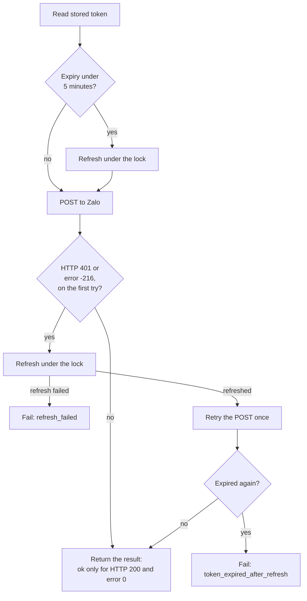

# Zalo OA Integration Reference

Oct 5, 2026 · @Peter

## Purpose and scope

This is the platform-neutral reference for sending and receiving Zalo Official Account (OA) messages. It was extracted from an earlier Apps Script – Google Sheets integration, keeping only the Zalo layer.

**In scope:** OAuth token refresh, sending text to a 1:1 chat (CS) and to a group chat (GMF), and parsing incoming webhook events.

**Out of scope:** secret storage, token persistence, logging, scheduling, and all business logic. These belong to the host application.

Each app that uses Zalo gets its own integration document (for example, Zalo ↔ Odoo). That document links here and covers only its host-specific choices, so changes to the Zalo API are made in one place.

The reference implementation is `zalo_client.js`: plain JavaScript using standard `fetch`, with no platform APIs.

## Zalo console setup

Sending and receiving rely on different console settings. Receiving needs no tokens at all; sending depends on the token pair that the one-time authorization through the callback URL produces.

| Console item | What it's for | Needed to send | Needed to receive |
| --- | --- | --- | --- |
| App ID | Identifies the app in token requests and signatures | Yes | Yes, for the signature check |
| App secret key | `secret_key` header on every token request | Yes | No |
| App linked to the OA | Lets the app act on behalf of the OA | Yes | Yes |
| Official Account Callback URL | Receives the code from the one-time authorization that produces the first tokens | Yes, at bootstrap and recovery | No |
| Webhook URL, with verified domain | Where Zalo posts chat events | No | Yes |
| Webhook event toggles | Which events Zalo posts | No | Yes |
| OA secret key | Verifying webhook signatures | No | Yes |

Setup order:

1. Create the app in the Zalo developer console and note the app ID and app secret key.
2. Link the app to the Official Account.
3. Register the Official Account Callback URL, then run the initial authorization (see Authentication and token lifecycle).
4. Verify the webhook domain, register the webhook URL, and note the OA secret key.
5. Enable the `user_send_text` and `user_send_group_text` events. A verified URL receives nothing for events left off.

Some features also depend on the OA's tier package; a missing package shows up as error `-224` when sending.

## Configuration and secrets

The Zalo code never reads storage itself; the host supplies these values and persists the tokens. The app secret and the OA secret key are two different values and must not be swapped. Where they live is the host's choice (environment variables, a secrets manager, a database config table) and is documented in each app's integration document.

| Value | Comes from | Sensitivity | Used for |
| --- | --- | --- | --- |
| App ID | Zalo developer console, app settings | Config, not secret | Body of the token refresh request; webhook signature check |
| App secret key | Zalo developer console, app settings | Secret | `secret_key` header on the token refresh request |
| OA secret key | Zalo developer console, webhook settings | Secret | Webhook signature check only |
| Access token | Each refresh response | Secret, short-lived | `access_token` header on every API call |
| Refresh token | The initial OA authorization, then each refresh response | Secret, single-use | The next refresh request |
| Token expiry | Computed from `expires_in` at refresh time | Not secret, optional | Proactive refresh before a call fails |

The first refresh token comes from the one-time initial authorization described under Authentication and token lifecycle. After that, every refresh returns a new pair, and both must be saved together before anything else uses them.

In the original Apps Script, the app ID and secret key sat in Script Properties and the tokens in User Properties. Neither exists outside Apps Script.

## Authentication and token lifecycle

Every API call carries an OA access token valid for about 25 hours; a refresh token, valid for about 3 months and usable once, gets the next pair ([Zalo developer community](https://developers.zalo.me/community/detail/d546eda3d1e638b861f7)). Always trust `expires_in` from the response over these figures.

### Initial authorization

This runs once to get the first token pair, and again only if the refresh token is lost or expires. An OA admin must approve it in a browser. The flow follows Zalo's own [PHP SDK](https://github.com/zaloplatform/zalo-php-sdk/blob/master/src/Authentication/OAuth2Client.php).

1. **Prepare.** The host generates a random `code_verifier` and `state`, and computes `code_challenge` = base64url of SHA-256(`code_verifier`), without padding. It keeps the verifier, keyed by `state`, until the callback arrives.
2. **Admin approves.** An OA admin opens `https://oauth.zaloapp.com/v4/oa/permission` with query parameters `app_id`, `redirect_uri` (the registered Official Account Callback URL), `code_challenge` and `state`, and grants the app permission.
3. **Callback.** Zalo redirects to the callback URL with `code` and `state` in the query string. The host rejects the request if `state` doesn't match a pending one.
4. **Exchange.** The host sends `POST https://oauth.zaloapp.com/v4/oa/access_token` with the same headers as a refresh (form encoding and the app secret in `secret_key`) and form fields `code`, `app_id`, `grant_type=authorization_code` and `code_verifier`.
5. **Save.** The response has the same shape as a refresh response. Save the access token, refresh token and expiry together.

If Zalo answers "invalid code verifier", check that the challenge is base64url without padding and that the verifier is the one generated in step 1.

### Refresh request

- **Endpoint:** `POST https://oauth.zaloapp.com/v4/oa/access_token`
- **Headers:** `Content-Type: application/x-www-form-urlencoded`, `secret_key: <app secret key>`
- **Body (form fields):** `refresh_token`, `app_id`, `grant_type=refresh_token`
- **Success:** HTTP 200 with `access_token`, `refresh_token` and `expires_in` (seconds)
- **Failure:** may still be HTTP 200, with `error`, `error_name` or `error_description` in the body. Reusing an old refresh token returns error `-14020`.

### The single-use rule

The moment a refresh succeeds, the old refresh token is dead. Three rules follow:

1. Save the new access token and refresh token together, before any other code uses them.
2. Never let two refreshes run at once. Both would send the same refresh token, one would fail with `-14020`, and if their saves overlap, the stored refresh token can end up being the dead one.
3. After acquiring the refresh lock, re-read the stored token. If another process refreshed in the meantime, use that token instead of refreshing again.

If the stored refresh token is lost or invalid, recovery is manual: run the initial authorization again.

### Detecting an expired access token

Zalo signals an expired or invalid access token in two ways: HTTP 401, or HTTP 200 with `"error": -216` in the JSON body. The client treats both the same: refresh once, retry the call once, and give up if the retry fails.



On the retry, an expired-token result is no longer "first try", so it fails instead of looping. If the refresh itself fails, the send fails. When the stored expiry is under 5 minutes away, the client also refreshes before the first POST.

## Sending messages

Both send calls are a JSON `POST` with the access token in a header named `access_token` (not `Authorization`). A send succeeded only when the response is HTTP 200 **and** the body has `"error": 0`.

| Message type | Endpoint | Recipient field | Where the recipient ID comes from |
| --- | --- | --- | --- |
| 1:1 chat (CS) | `https://openapi.zalo.me/v3.0/oa/message/cs` | `recipient.user_id` | `sender.id` of a `user_send_text` event |
| Group chat (GMF) | `https://openapi.zalo.me/v3.0/oa/group/message` | `recipient.group_id` | `recipient.id` of a `user_send_group_text` event |

Headers for both:

```
Content-Type: application/json
access_token: <current access token>
```

Body, 1:1 chat:

```json
{ "recipient": { "user_id": "<user id>" }, "message": { "text": "Hello" } }
```

Body, group chat:

```json
{ "recipient": { "group_id": "<group id>" }, "message": { "text": "Hello" } }
```

Only plain text was used in the original integration. Attachments, templates and other message types exist in the Zalo API but are not covered here.

## Receiving webhooks

Zalo posts each event as JSON to the webhook URL set in the developer console; the host must verify it, deduplicate it, answer 200 fast, then process it. Two text events are handled; all others are acknowledged and ignored.

| Field | `user_send_text` (1:1 chat) | `user_send_group_text` (group chat) |
| --- | --- | --- |
| `event_name` | `user_send_text` | `user_send_group_text` |
| `sender.id` | The user; reply to this ID | The user who posted in the group |
| `recipient.id` | The OA | The group; reply to this ID |
| `message.text` | Message text | Message text |
| `message.msg_id` | Unique message ID, used for dedupe | Unique message ID, used for dedupe |
| `timestamp` | Epoch milliseconds, as a string | Epoch milliseconds, as a string |
| `app_id`, `oa_id` | Your app and OA | Your app and OA |

An example `user_send_text` body, as posted by a developer on the [Zalo community forum](https://developers.zalo.me/community/detail/e9f41c09204cc912905d):

```json
{
  "event_name": "user_send_text",
  "app_id": "50554360515256678",
  "sender": { "id": "5510185758261927916" },
  "recipient": { "id": "1646843870823903717" },
  "message": { "text": "Helo", "msg_id": "e2a641af6661713b2874" },
  "timestamp": "1717061839659",
  "user_id_by_app": "3611371994410983884"
}
```

### Handling rules

1. **Verify the signature.** Zalo sends an `X-ZEvent-Signature` header holding a SHA-256 hex digest of `app_id + raw body + timestamp + OA secret key`, sometimes shown with a `mac=` prefix ([implementation notes](https://github.com/sanglnv/zalo-bot)). Hash the body exactly as received, never re-serialized JSON, and take `timestamp` from the body. Several developers report mismatches on the forum, so test against a real event before rejecting on failure.
2. **Answer HTTP 200 quickly.** Do slow work (database writes, replies) after responding or in a background job.
3. **Deduplicate by `message.msg_id`.** Zalo can deliver the same event more than once. Keep seen IDs for a few hours; the original script kept them for 2 hours. Drop events with no `msg_id`.
4. **Route by `event_name`.** Ignore events you don't handle, but still answer 200.

Apps Script never exposes request headers, which is why the original integration could not verify signatures. Any host that can read headers, such as an Odoo HTTP controller, should.

## Error reference

Zalo often returns HTTP 200 for failures, so always read the `error` field in the body; only `0` means success. These are the signals the original integration met or guarded against.

| Signal | Seen on | Meaning | What to do |
| --- | --- | --- | --- |
| HTTP 200, `error: 0` | Send | Success | Done |
| HTTP 401 | Send | Access token expired or invalid | Refresh once, retry once |
| HTTP 200, `error: -216` | Send | Access token expired or invalid | Refresh once, retry once |
| HTTP 200, `error: -224` | Send | OA tier package does not include this feature | Don't retry; upgrade the OA package |
| HTTP 200, `error: -14020` | Refresh | Refresh token already used or expired | Don't retry; check token storage, re-authorize if lost |
| HTTP 200 with `error`, `error_name` or `error_description` | Refresh | Refresh failed | Don't save anything; log the body |
| Body is not JSON | Any | Unexpected response | Treat as failure; log the raw body |
| Any other code | Send | Failure; reason in `message` | Log it; don't retry |

Sources for `-14020` and `-224`: [Zalo developer community](https://developers.zalo.me/community/detail/d546eda3d1e638b861f7).

## Host responsibilities checklist

Every app integration document should answer each of these. Copy the list there and tick it off.

- [ ] **Secrets:** where the app ID, app secret key and OA secret key are stored, and who can read them
- [ ] **Token store:** where the access token, refresh token and expiry are saved, written together in one operation
- [ ] **Refresh lock:** how concurrent refreshes are prevented (a database row lock, a mutex, a single worker)
- [ ] **Bootstrap:** the callback route that runs the initial authorization, where the code verifier and state wait between the link and the callback, and who re-runs it if the refresh token is lost
- [ ] **Webhook endpoint:** the public HTTPS URL registered in the Zalo developer console
- [ ] **Signature check:** reads `X-ZEvent-Signature` and the raw body, and decides what happens on mismatch
- [ ] **Dedupe store:** where seen `msg_id` values are kept, and for how long
- [ ] **Fast response:** heavy work moved after the 200 response or into a background job
- [ ] **Logging:** what is logged, with tokens and secrets never written to logs
- [ ] **Routing:** which events and messages map to which actions in the host app

## Reference implementation: zalo\_client.js

`zalo_client.js` is a single ES module with no dependencies. It needs global `fetch` (Node 18+) and, for signature checks and the authorization link only, Web Crypto (Node 19+). It was tested against mocked Zalo responses (refresh then retry, a reused refresh token, signature match and mismatch, event parsing, the authorization link and code exchange), not yet against the live API.

| Export | Replaces in the original script | What it does |
| --- | --- | --- |
| `createZaloClient(config)` | Global constants and property reads | Builds a client from host-supplied config |
| `client.sendCSMessage(userId, text)` | `sendCSMessage` | Sends to a 1:1 chat; returns a result object |
| `client.sendGMFMessage(groupId, text)` | `sendGMFMessage` | Sends to a group chat; returns a result object |
| `client.postWithTokenRefresh(url, body, context)` | `fetchWithTokenRefresh` | Any OpenAPI POST with refresh once, retry once |
| `client.refreshAccessToken(staleToken)` | `refreshZaloAccessToken`, `getValidZaloAccessToken` | Refreshes under the host lock and saves the pair |
| `client.buildAuthorizationRequest(redirectUri)` | Nothing; new | Returns the permission link plus the `codeVerifier` and `state` to keep |
| `client.exchangeAuthorizationCode(code, codeVerifier)` | Nothing; new | Swaps the callback code for the first token pair and saves it |
| `verifyWebhookSignature({...})` | Nothing; new | Checks `X-ZEvent-Signature` against the raw body |
| `parseWebhookEvent(rawBody)` | Parsing inside `doPost` and both handlers | Returns a normalized event, or null |
| `ZALO_ENDPOINTS`, `ZALO_ERRORS`, `ZALO_EVENTS` | `ZALO_*` constants | Endpoint URLs, error codes, event names |

### Config the host passes in

- `appId`, `appSecretKey`: from the host's secret storage. The OA secret key is passed to `verifyWebhookSignature` only.
- `tokenStore`: `{ get(), save(tokens) }`, where tokens are `{ accessToken, refreshToken, expiresAt }` and `expiresAt` is epoch milliseconds.
- `withRefreshLock(fn)`: runs `fn` under an exclusive lock. The default has no lock and is safe only in a single process.
- `logger` (optional): `{ info, warn, error }`. It never receives tokens or secrets.
- `fetchImpl` (optional): a `fetch` override for tests.

### What a send returns

`{ ok, status, data, error }`. `ok` is true only for HTTP 200 with `error: 0`. When false, `error` is one of `no_access_token`, `network_error`, `refresh_failed`, `token_expired_after_refresh` or `api_error`, and `data` holds Zalo's body when there was one.

### Left out of the module

Firestore sync, Drive image upload, the Sheets log, the `#bao`, `#list`, `#nhan` and `#dong` commands, overdue checks, preventive maintenance, `cleanUpLogSheet`, `healthCheck`, the CacheService dedupe and the hardcoded error-mail address. Dedupe, logging and alerts are host responsibilities now; the usage sketch at the end of the file shows where they plug in.

## Caveats and open points

The biggest practical risk is moving tokens between hosts: only one host may hold and refresh the token pair at a time.

- **Migrating from Apps Script.** Copy the current refresh token from the script's User Properties into the new host's store, then stop the Apps Script from sending. The first refresh on either side kills the other side's copy.
- **One webhook URL per app.** Zalo posts events to one URL, so only one host receives messages at a time. Switch the URL in the developer console when cutting over.
- **Callback URL follows the host.** The Official Account Callback URL must point to a route on the host that performs the code exchange. When moving to Odoo, point it at an Odoo route; otherwise a re-authorization lands on the old host and its tokens never reach Odoo.
- **Signature check unverified here.** The formula comes from community sources, not a live test. Log mismatches first and only enforce rejection once real events pass.
- **Behavior changes from the original.** Sends now return a result object, a stored expiry triggers a proactive refresh, and dedupe should cover 1:1 chats too, not only groups.
- **Expiry fallback.** When `expires_in` is missing, 90000 seconds (25 hours) is assumed. The original script's comment called this 1 hour, which was wrong.
- **Text only.** Images, stickers, follow and unfollow events, and other message types are not handled.

## Sources

- [Zalo developer community: access token 25 hours, refresh token 3 months, single use, error -14020](https://developers.zalo.me/community/detail/d546eda3d1e638b861f7)
- [Zalo developer community: X-ZEvent-Signature formula and sample payload](https://developers.zalo.me/community/detail/e9f41c09204cc912905d)
- [Zalo PHP SDK, OAuth2Client: OA permission link and authorization code exchange](https://github.com/zaloplatform/zalo-php-sdk/blob/master/src/Authentication/OAuth2Client.php)
- [Zalo PHP SDK, README: OA admin approval redirects to the registered callback URL](https://github.com/zaloplatform/zalo-php-sdk/blob/master/README.md)
- [sanglnv/zalo-bot: OAuth v4 refresh details, app secret vs OA secret key, signature header](https://github.com/sanglnv/zalo-bot)
- The original Apps Script, `zalo_webhook_script.js`
