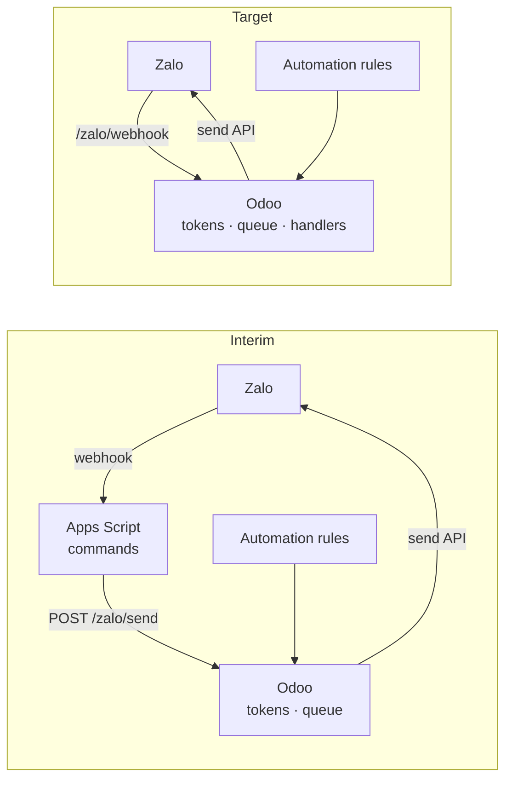

# Zalo ↔ Odoo Integration Design Note

Oct 5, 2026 · @Peter · Status: draft · Revised Oct 7, 2026

## Purpose and decisions

This note designs the Zalo integration for Odoo 18 CE. It covers only the Odoo-specific choices; how the Zalo API works lives in the [Zalo OA Integration Reference](Zalo%20OA%20Integration%20Reference.md) (`docs/Zalo OA Integration Reference.md`), which this note does not repeat.

**Revision.** Reviewed against the Odoo source and this instance's configuration. The main change: each Odoo instance names **its own Zalo app** in `odoo.conf`, and tokens are stored per app, so a production database restored onto the test instance can neither use nor kill production's tokens, and an optional redirect keeps a test instance's messages out of real chats. The refresh runs inside the cron with an immediate commit, sends commit one by one, the queue takes raw recipients, and the Settings model is gone. §"Changes from the first draft" lists them.

**v1 (Oct 8, 2026).** v1 ships the interim architecture as its steady state: Odoo owns the tokens and sends, and the Apps Script keeps receiving the webhook and running its commands, replying through `/zalo/send`. Receiving in Odoo — the receiving path, `zalo.event`, `/zalo/webhook` — and phase 4, which retires the Apps Script, come after v1; their spec is `zalo_oa` step 5, deferred (`docs/modules/zalo_oa.md`). Phases 2, 3 and 5 are unchanged.

| Decision | Choice | Why |
| --- | --- | --- |
| Token owner | One Odoo instance per Zalo app, the only system that refreshes that app's tokens | Refresh tokens are single-use; two refreshers break each other |
| Instance configuration | The app's ID and secrets in the instance's `odoo.conf`; no app configured means Zalo is off | Instance-specific values live with the instance, not in a database that gets copied |
| Token storage | One `zalo.token` row per app ID; only the configured app's row is used | A restored database carries other apps' tokens harmlessly |
| Test instances | An optional redirect recipient in `odoo.conf` sends every message to one test chat | A restored database also carries production's destinations and automation rules |
| Interim role of the Apps Script | Keeps receiving webhooks and running its commands, but sends every reply through Odoo | Lets Odoo own tokens now, without moving the commands first |
| Refresh strategy | Scheduled refresh as primary; refresh-on-expiry kept as fallback | The cron handles normal operation; the fallback covers downtime and cron failures |
| Packaging | One custom module, working name `zalo_oa`, modelled on Odoo's SMS module | The SMS module already solves templates and a send action for another channel |
| Sending | A queue record, sent by a cron that the queueing wakes at once (`ir.cron._trigger()`), committing after each message | Core's own pattern; one send path; never blocks the user's request; nothing sent twice |
| Configuration of notifications | Automation rules and Zalo templates in the UI | New notifications need no code |
| Isolation | A Zalo failure of any kind never fails, blocks or slows an Odoo operation (§"Isolation from Odoo") | Notifications ride on Odoo events; they must not be able to break them |
| Target state | Odoo also receives webhooks; the Apps Script is retired | One system, one set of secrets |

## Scope of notifications

Nothing in the module is tied to one application. The server action type works on any model, a template names its model, and destinations are plain recipients, so any automation rule can notify through Zalo:

- **Maintenance:** new requests, pauses, SLA breaches (the first ones planned, below).
- **Quality:** a failed inspection, a nonconformity raised.
- **Purchase, sales, accounting:** an order waiting for approval, an overdue invoice, a payment received.

These are **internal** notifications, to the company's own groups and staff through the OA's chats. Messaging customers or suppliers on Zalo is a different service, ZNS (Zalo Notification Service), with templates approved by Zalo and billed per message; it is out of scope.

**Recipients in v1 are configured destinations — group chats and individual users — and raw IDs from the `/zalo/send` route.** Both kinds were confirmed in the phase 0 test (group and 1:1, Oct 2026). Sending to a person *derived from the record*, such as a request's technician, needs a link from Odoo users to Zalo user IDs; it is deferred until the webhook can capture those IDs from users who message the OA.

## Architecture

Odoo takes over sending and tokens first; receiving moves later, so the riskiest change (token ownership) happens once and early.

In the interim, the Apps Script calls an Odoo endpoint for every reply, so Odoo is the only system that talks to Zalo's send and token endpoints. Odoo's own notifications come from automation rules inside the same module. At cutover, the webhook URL moves to Odoo and the Apps Script is retired.

**Routes sit at the domain root.** `/odoo` is only Odoo 18's web-client path; the test instance's callback is `https://odoo.quangphuong.net/zalo/callback`. The instance's nginx passes `/` to Odoo (`images/odoo/nginx.conf:132-133`).

## Instances, apps and configuration

### One app per instance

Each Odoo instance that talks to Zalo has **its own Zalo app**, linked to the same Official Account. A Zalo app has one callback URL and one webhook URL, and its token pair can have only one refresher, so app and instance go together.

The instance's `odoo.conf` names its app. On this instance the file is generated at container start, and the generator appends the `ADDITIONAL_ODOO_RC` environment variable to it (`images/odoo/bin/template-odoo-rc`). The `odoo` service of `compose.yml.template` builds that variable as a YAML `|-` block of `zalo_… = ${ZALO_…}` lines, and `.env` holds the values as plain single-line variables (`ZALO_APP_ID`, `ZALO_APP_SECRET`, …) — never the generated file by hand. A `\n` inside a `.env` value is not turned into a newline here, so the lines come from the YAML block (found at `zalo_oa` step 1). Odoo keeps every key of the `[options]` section (`odoo/tools/config.py:703-709`), and the module reads them with `odoo.tools.config.get()`.

| Key | Content | Required |
| --- | --- | --- |
| `zalo_app_id` | The app's ID | Yes — without it the module neither sends nor refreshes |
| `zalo_app_secret` | The app secret key, for token requests | Yes |
| `zalo_oa_secret` | The OA secret key, for webhook signatures | For receiving |
| `zalo_redirect_recipient` | `group:<id>` or `user:<id>`: every message is sent there instead, its text naming the intended recipient | No — set on test instances, never on production |

**No app configured, no Zalo.** The app ID is the switch: an instance without one queues messages but sends none and refreshes nothing.

**Tokens are stored per app.** `zalo.token` has one row per app ID, and the module only ever reads, uses or refreshes the row of the app its `odoo.conf` names.

### A production database restored onto test

The restore copies production's `zalo.token` row, destinations, automation rules and any queued messages. With the configuration above:

1. **Production's tokens are safe.** The copied row belongs to production's app, which test's `odoo.conf` does not name, so test never sends with it nor refreshes it.
2. **Test re-authorizes once.** Its own token row was replaced by the restore; an administrator runs *Authorize* on test and approves in Zalo — about a minute.
3. **Test's messages stay in the test chat.** Test's `odoo.conf` sets `zalo_redirect_recipient`, so production's destinations and automation rules, now running on test data, reach only that chat.

The Apps Script posts to whichever instance its Script Properties name. A restore also copies production's users and their API keys, so a key created on production authenticates against the restored test too: revoke it on whichever side should not accept it.

### Rollout

| Phase | Test instance `odoo.conf` | Production `odoo.conf` | Apps Script posts to |
| --- | --- | --- | --- |
| Interim | app A — the current one — no redirect: test sends for itself and for the Apps Script, to real chats | — | test |
| Production live | app B, a new app linked to the same OA, with the redirect to a test chat | app A; its callback and webhook URLs move to the production domain | production |

App A stays with production because it is already linked and configured. Either assignment works; it is configuration only.

## Token ownership and refresh

Odoo refreshes on a schedule, and every send keeps the refresh-on-expiry wrapper from the Apps Script as a fallback. Odoo's cron cannot run while the server is down, so the wrapper stays.

| Situation | What happens | Covered by |
| --- | --- | --- |
| Normal operation | The cron refreshes before the access token expires | Cron |
| Server down for less than the token's life (about 25 hours) | The stored token may still be valid; the missed cron runs once the server is back | Cron |
| Server down for longer | The first send gets `-216`, refreshes and retries | Fallback |
| Cron stopped or failing | Sends still refresh on expiry | Fallback, plus an alert |
| Zalo invalidates a token early | The next send gets `-216` | Fallback |
| Refresh token expired (about 3 months unused) or lost | Nothing can refresh | Re-run the initial authorization |
| Database restored from another instance | The copied row belongs to another app and is ignored | Configuration per app |

The fallback only runs when something sends. If the cron is broken and nothing is sent for months, the refresh token expires silently, so the cron's health is monitored rather than assumed.

### Rules for the implementation

1. **One refresh function.** The refresh cron and the send fallback both call the same `_refresh()`; there is no second code path.
2. **Zalo is called from crons only** — the send queue, the refresh and, later, event processing — and from `/zalo/callback`'s code exchange. No user request waits on Zalo.
3. **Lock, re-read, refresh, save, commit.** Inside the cron's transaction, `_refresh()` locks the token row (`SELECT ... FOR UPDATE`), re-reads it, and skips the refresh if another worker already did it — the instance runs two workers and two cron threads, so a refresh and a send can overlap. Otherwise it refreshes, saves the new pair and **commits at once**, so nothing later in the cron can roll back a pair Zalo has already rotated.
4. **Commits only outside tests.** The commit is governed by an `auto_commit` flag decided as core's mail queue decides it — not in a testing thread (`mail/models/mail_mail.py:263`) — so the refresh logic is tested without a separate cursor or a test seam.
5. **Cron cadence (proposed).** Hourly, refreshing when less than 6 hours remain, so a single failed run never lets the token lapse. The cadence is the cron record's own setting.
6. **Health alert (proposed).** The token row stores the time of the last successful refresh and a responsible user. If the last refresh is older than 2 days, the cron schedules an activity for that user, while the refresh token still has months left.

## Module design

The module `zalo_oa` copies the shape of Odoo's SMS module: templates with placeholders, a server action type, and a message log, with the Zalo client underneath — a Python port of the reference's `zalo_client.js`.

### Models

| Model | Purpose | Main fields |
| --- | --- | --- |
| `zalo.token` | One row per app | App ID (unique), access token, refresh token, expires at, last refresh at, last error, alert user; the pending authorization's state and code verifier, with its time. Access rule and field `groups` both `base.group_system` |
| `zalo.destination` | Named recipients, so rules never hold raw IDs | Name, type (group or user), Zalo ID, active |
| `zalo.template` | Message text with field placeholders; inherits `mail.render.mixin`, as `sms.template` does (`sms/models/sms_template.py:10`) | Name, model, body rendered as a plain-text inline template (`{{ object.field }}`), not HTML |
| `zalo.message` | Queue and log of every send | Recipient type and Zalo ID; destination (optional — it supplies the ID); text; state (queued, sent, failed); attempts; last error; Zalo's response; sent at; source record and template |
| `zalo.event` (target state) | Received webhook events | `msg_id` with a **unique index**, event name, sender, recipient, text, raw body, state (received, processed, ignored, failed) |

**Secrets** are never stored in the database or shown in the UI: they are read from `odoo.conf` (§"Instances, apps and configuration"). **Tokens** necessarily live in the database, readable by system administrators only, and are therefore part of database backups, which is accepted. Logs and `zalo.message` records hold message text and Zalo's response, never tokens or secrets.

**Raw recipients.** A message carries its recipient type and Zalo ID itself, so replies from `/zalo/send` — to whichever user or group wrote to the OA — need no configured destination. A destination, when given, supplies them.

**The redirect is applied at send time,** from the current `odoo.conf`: the message keeps its intended recipient in the log, and the text sent names it.

### Server action type

Add a "Send Zalo message" option to the server action type list, as the SMS module adds "Send SMS": a `state` value added through `selection_add`, a template field, destination fields, and a `_run_action_zalo_multi` method (the SMS module's at `sms/models/ir_actions_server.py:13-15, 72`). It renders the template for each record and queues one message per destination, and **never raises** (§"Isolation from Odoo"). Automation rules accept any server-action type (`base_automation/models/base_automation.py:100-101`), so they use it with no code.

For anything a template cannot express, "Execute Code" actions call the module directly, for example `env['zalo.message']._queue(recipient_type, zalo_id, text, record)`.

### Routes

| Route | Who calls it | Authentication | Purpose |
| --- | --- | --- | --- |
| `/zalo/authorize` | An Odoo administrator, in the browser | Logged-in system administrator | Builds the permission link for the configured app, stores state and verifier on its token row, redirects to Zalo |
| `/zalo/callback` | Zalo, after the OA admin approves | Public, checked by `state` | Exchanges the code and saves the first token pair on the configured app's row |
| `/zalo/send` | The Apps Script, in the interim | **`auth='bearer'`** (`base/models/ir_http.py:204`): the API key of a technical user in the module's *Zalo sender* group | Queues a message to a raw recipient; created as superuser once the group is checked, so the technical user needs no other rights |
| `/zalo/webhook` | Zalo, in the target state | Public, checked by signature | Verifies, deduplicates and queues chat events |

Odoo 18's native bearer authentication means no custom key checking: the key is created and revoked in the technical user's preferences, and rotating it needs no restart.

### Scheduled actions and cleanup

- **Token refresh:** hourly, as described above.
- **Send queue:** sends queued messages; woken at once by each queueing (`_trigger()`), and run on a schedule as catch-up and retry.
- **Event processing (target state):** processes received events; woken the same way.
- **Cleanup:** old `zalo.message` and `zalo.event` records are removed by an `@api.autovacuum` method, core's idiom for housekeeping, not by a cron of the module's own.

## Sending path

Every send becomes a `zalo.message` record first and goes to Zalo only from the send-queue cron, so a rolled-back record never produces a message and the user's request never waits on Zalo.

1. **Queue.** A server action, code, or the `/zalo/send` route creates a `zalo.message` in state queued, inside the caller's transaction, and calls `_trigger()` on the send-queue cron. If that transaction rolls back, the message and the trigger disappear with it.
2. **Send.** The trigger wakes the cron right after the commit, in a cron worker with its own transaction, so normal messages arrive within seconds. Core runs its web-push queue the same way (`mail/models/mail_thread.py:3846`), and SMS is a queue processed by a cron (`sms/models/sms_sms.py:147`). Without a configured app, the cron sends nothing and the messages stay queued.
3. **Commit after each message.** Once Zalo has accepted a message, it is marked sent and **committed before the next**, under the same `auto_commit` flag as the refresh — as core's mail queue commits each mail, and SMS's `_process_queue` commits "after each message is sent" (`sms/models/sms_sms.py:147-149`). A crash mid-batch then cannot send a message twice.
4. **Catch-up.** The same cron also runs on a schedule, so anything still queued — after a failure or a server stop — is sent then. There is one send path.
5. **Record the result.** The message becomes sent, with Zalo's response, or failed, with the reason.

A post-commit hook was considered and not used: it runs inside the user's request, after commit but before the response, so every save that notifies would wait on Zalo, and it needs its own cursor and error path beside the cron's. It also never fires in tests.

Retry only what can recover: network errors and failed refreshes are retried a few times by the cron. Zalo errors such as `-224` or an invalid recipient fail immediately and stay visible in the log.

## Isolation from Odoo

Notifications ride on Odoo events — a request created, a stage changed, an SLA breached — so a failure
on the Zalo side must never fail, block or slow the Odoo operation that triggered it. Most of that
follows from the design: no user request waits on Zalo, since every call to it happens in a cron with
its own transaction. Two places still need rules of their own.

**1. Queueing never raises.** Queueing runs inside the user's transaction, and an automation rule
re-raises any exception its server actions throw (`base_automation/models/base_automation.py:737-742`),
so the user's save would fail with it. A broken template — a typo such as
`{{ object.equipment_id.nmae }}` — or a destination left without a Zalo ID would then make every save
of the triggering records fail. SMS's own action has no guard against this
(`sms/models/ir_actions_server.py:72-89`), so the module departs from its model here:

- `_run_action_zalo_multi` and `_queue()` render and create inside a savepoint (`self.env.cr.savepoint()`).
- On any exception, the savepoint rolls back only the module's own work; the error is logged and kept
  as a `zalo.message` in state *failed*, with the error and the source record, so it is visible in the
  log; the user's save continues untouched.
- If even the failed record cannot be written, the error is logged and nothing else happens.

**2. The crons never fail.** Odoo deactivates a cron that fails five times in a row over at least seven
days (`ir_cron.py:24-25, 457-494`), and notifications would stop silently. The send and refresh crons
catch errors per message and per refresh, record them on the message or the token row, and always
finish normally. A refresh that keeps failing is caught by the health alert.

**Already isolated:**

| Failure | Effect on Odoo |
| --- | --- |
| Zalo down, slow, or answering an error | None: only the send cron waits or fails, in its own transaction |
| Access token expired, refresh token lost | None: messages stay queued or fail in the log; the health alert fires |
| No app configured on the instance | None: messages are queued and not sent |
| A `/zalo/*` route fails | Only its caller — Zalo or the Apps Script — sees the error |

**Tested:** an automation rule with a deliberately broken template still lets the triggering record
save, and leaves a failed message; a send cron meeting a Zalo error finishes normally with the message
marked failed.

## Receiving path (target state)

1. **Verify.** Hash the raw body exactly as received (`request.httprequest.get_data()`), with the app ID, the body's timestamp and the OA secret key, and compare with the `X-ZEvent-Signature` header using `hmac.compare_digest`. Mismatches are logged, not rejected, until real events are seen to pass.
2. **Deduplicate.** Insert a `zalo.event`. The unique index on `msg_id` refuses a repeat delivery, which is acknowledged and dropped. Exact, and it survives restarts, unlike a time-windowed cache. Events without a `msg_id` are dropped.
3. **Answer 200** at once, and wake the event-processing cron with `_trigger()`.
4. **Process** in the cron: route by event name to handlers; events not handled are marked ignored.

## Configuring notifications

A notification is an automation rule plus a Zalo template, built in the UI. These are the first ones planned, on maintenance:

| Notification | Model | Automation rule trigger | Template example | Destination |
| --- | --- | --- | --- | --- |
| New request | `maintenance.request` | On save, *When updating*: Created on (`create_date`) | `New request {{ object.name }} on {{ object.equipment_id.name }}` | Maintenance group |
| Request paused | `maintenance.request` | On save, *When updating*: Stage (`stage_id`), filter `sla_live_state = 'paused'` | `{{ object.name }} paused: {{ object.equipment_id.name }}` | Maintenance group |
| SLA breached | `maintenance.request.sla` | Time-based on `deadline`, delay 0, filter `state = 'running'` | `SLA breached: {{ object.sla_id.name }} on {{ object.request_id.name }}, technician {{ object.request_id.user_id.name }}` | Maintenance manager |

The fields come from `maintenance_sla`: `sla_live_state` on the request is searchable, so it can serve as an automation filter; the breach rule runs on the SLA record, so a *Response* breach and a *Restore* breach are separate messages. This is also the escalation by Automated Actions that the SLA design's §7 anticipated.

Time-based triggers are checked by Odoo's automation cron, not instantly, so a breach message arrives up to one check interval late.

**An *On save* rule needs *When updating* fields.** With none, every field is watched: the rule fires on
the create, on every later write and on every stored-field recompute — the last ones within the same
save, since `base_automation` patches `create`, `write` and `_compute_field_value` and its once-only
guard lives in one call chain's context (`base_automation/models/base_automation.py:697-714, 776-860`).
A new request was notified twice at `zalo_oa` step 3's UI check, and every later edit would have
notified again; SMS and email actions behave the same. *On creation* is deprecated in Odoo 18 and
hidden from the trigger list. So:

- **when a record is created:** *On save*, watching **Created on** (`create_date`). A create counts every
  watched field as modified (`:751-753`), and `create_date` never changes, so the rule fires once per
  new record;
- **when a field changes:** *On save*, watching that field — **Stage** for a pause — plus a filter. Writes
  that leave it unchanged do not fire.

### Inbound commands (target state)

Once `/zalo/webhook` receives chat events, they are queued and handed to handlers in Odoo. The Apps Script's commands (`#bao`, `#list`, `#nhan`, `#dong`) map naturally onto maintenance request actions; their Odoo design is deferred until the interim phase is running.

## Migration and cutover

The token handovers are the only steps that can break the live chat, so they run in quiet hours and in a fixed order.

### Phase 0: quick test — done

Messages were sent from the Odoo container with an access token borrowed from the Apps Script, without calling the refresh endpoint: to a group chat and to a 1:1 chat, both delivered (Oct 2026). The OA's package allows group sends.

### Phase 1: build the module

- [x] Token model per app, Zalo client port, refresh under the row lock with its commit
- [x] Message queue and log, send-queue cron with `_trigger()` and a commit per message
- [x] `/zalo/authorize`, `/zalo/callback` and `/zalo/send` (bearer) routes; the *Zalo sender* group, the technical user and its API key
- [x] App A's keys in the test instance's `.env`, through `ADDITIONAL_ODOO_RC`
- [x] Test sends to a test destination, with a borrowed access token only
- [x] **No refresh token in Odoo yet.** Do not put a refresh token in Odoo while the Apps Script still refreshes it: Odoo's refresh cron rotates any refresh token it finds, and the Apps Script then fails with `-14020`. The live refresh is first checked at phase 2, step 3

### Phase 2: token handover to the test instance

Done Oct 8, 2026, in this order — the callback URL first, since *Authorize* needs it:

1. Point app A's callback URL in the Zalo console at `https://odoo.quangphuong.net/zalo/callback`.
2. Deploy the Apps Script change: `sendGMFMessage` and `sendCSMessage` post `{recipient_type, recipient, text}` to the test instance's `/zalo/send` with the technical user's API key as a bearer token; the refresh functions are removed, not just unused; the Odoo URL and API key live in Script Properties. Replies queue in Odoo from here, and go out once Odoo holds a valid token.
3. *Authorize* on app A's `zalo.token` row, approved at Zalo — instead of copying the Apps Script's refresh token: no secret copied by hand, and the callback's first pair saved.
4. *Refresh now*, and a send from each side: Odoo rotated the pair, and messages from the Apps Script and from Odoo arrived.
5. To confirm on Oct 9: the refresh cron's own refresh, once fewer than six hours remain.
6. Clear the app secret and the old tokens from the Apps Script's Script and User Properties — moved here from phase 4, since v1 keeps the script and it no longer needs them.

### Phase 3: notifications

Done Oct 8, 2026, as a module rather than in the UI: `zalo_oa_garment` (`docs/modules/zalo_oa_garment.md`) ships the templates and automation rules as `noupdate` data, so test and production carry the same ones, and each instance adds its own destinations. It covers eight notifications in Vietnamese — new corrective request, paused, restored, technician assigned, SLA at risk, SLA breached, new inspection, inspection awaiting approval or failed — and departs from the section above where the module doc's divergences say: the breach rule fires 1 minute after the deadline, and *paused* filters on the waiting stages.

### Phase 4: receiving and retirement

- [ ] `zalo.event` and `/zalo/webhook` live, with signature mismatches logged before they are enforced
- [ ] Command handlers in Odoo, or the commands dropped on purpose
- [ ] The Apps Script's overdue checks and maintenance reminders replaced in Odoo, or dropped on purpose
- [ ] Webhook URL switched to Odoo in the Zalo console
- [ ] Apps Script triggers deleted and the web app undeployed
- [ ] The Firebase private key cleared from Script Properties (the app secret and old tokens: phase 2, step 6)
- [ ] The technical user's API key revoked in Odoo

### Phase 5: production live

In this order, so app A never has two refreshers:

1. Create app B in the Zalo console and link it to the OA; register the test instance's callback (and webhook, if receiving is live) on it.
2. Switch the test instance's `.env` to app B and set `zalo_redirect_recipient` to a test chat; restart. Test stops using app A.
3. Put app A's keys in production's `.env`; move app A's callback and webhook URLs to the production domain; run `/zalo/authorize` on production.
4. Point the Apps Script at production's `/zalo/send` with a production API key.
5. Run `/zalo/authorize` on test for app B.

After every later restore of production onto test: step 5 again.

## Place in the project

`zalo_oa` is a supporting integration, outside the QMS/PMS phases: it depends on `mail` and `base_automation`, and maintenance, quality and other applications use it through configuration only. It is listed in the plan's module breakdown (§8), pointing here.

## Open questions

- **Several apps on one OA.** Assumed possible; confirmed when app B is linked in phase 5. If it is not, the test instance runs with no app configured after production goes live.
- **Recipient IDs across apps.** Group and user IDs are expected to belong to the OA, not the app — the webhook reports `sender.id` separately from `user_id_by_app` — so production's destinations keep working on app A and the redirect recipient works on app B. One send from app B to a known group confirms it.
- **A fresh authorization and the existing pair.** Whether authorizing an app again invalidates its current token pair. Phase 5 sidesteps it: test leaves app A before production authorizes it.
- **Commands.** Do the chat commands move to Odoo one to one, or get redesigned around maintenance requests?
- **Signature formula.** Taken from community sources; logged before enforced.

## Changes from the first draft

| First draft | Revised | Why |
| --- | --- | --- |
| One instance, one token record | One Zalo app per instance, named in its `odoo.conf`; one token row per app ID | Test and production both exist, and production is restored onto test: a copied token must neither send nor be refreshed by the wrong instance |
| — | `zalo_redirect_recipient` for test instances | A restore also copies production's destinations and automation rules |
| A Settings model for App ID, cron cadence and alert recipient | App ID in `odoo.conf` with the secrets; cadence on the cron record; the alert user on the token row | Instance values belong with the instance; a database setting is copied by a restore |
| Refresh in a separate cursor, with a test seam | Refresh inside the cron's transaction, committed at once under an `auto_commit` flag | Zalo is only called from crons and the callback, so the cron's own commit suffices, and the flag keeps it testable |
| Send results recorded, no word on duplicates | A commit after each message | A crash mid-batch would otherwise resend messages Zalo had accepted |
| Messages addressed to destinations | Messages carry recipient type and Zalo ID; the destination is optional | `/zalo/send` replies go to whoever wrote to the OA |
| Cleanup cron | `@api.autovacuum` | Core's idiom |
| — | §"Isolation from Odoo": queueing never raises, the crons never fail | An automation rule re-raises its actions' errors, and Odoo deactivates a cron that keeps failing |
| Phase 0 planned; 1:1 an open question | Phase 0 done, group and 1:1 delivered | Tested Oct 2026 |
| Cutover from the Apps Script only | Phases 2 (to test) and 5 (production live, app B for test) | The test instance takes over first |
