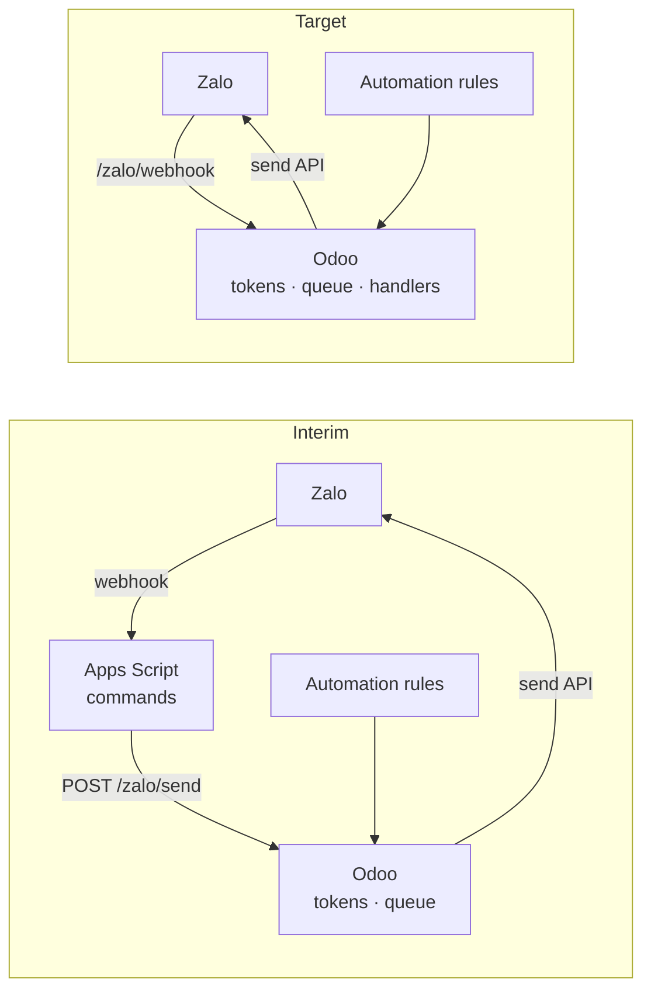

# Zalo ↔ Odoo Integration Design Note

Oct 5, 2026 · @Peter · Status: draft

## Purpose and decisions

This note designs the Zalo integration for Odoo 18 CE. It covers only the Odoo-specific choices; how the Zalo API works lives in the [Zalo OA Integration Reference](Zalo%20OA%20Integration%20Reference.md) (`docs/Zalo OA Integration Reference.md`), which this note does not repeat.

| Decision | Choice | Why |
| --- | --- | --- |
| Token owner | Odoo, as the only system that refreshes | Refresh tokens are single-use; two refreshers break each other |
| Interim role of the Apps Script | Keeps receiving webhooks and running its commands, but sends every reply through Odoo | Lets Odoo own tokens now, without moving the commands first |
| Refresh strategy | Scheduled refresh as primary; refresh-on-expiry kept as fallback | The cron handles normal operation; the fallback covers downtime and cron failures |
| Packaging | One custom module, working name `zalo_oa`, modelled on Odoo's SMS module | The SMS module already solves templates and a send action for another channel |
| Sending | A queue record, sent by a cron that the queueing wakes at once (`ir.cron._trigger()`) | Core's own pattern; one send path; never blocks the user's request |
| Configuration | Notifications built from automation rules and Zalo templates in the UI | New notifications need no code |
| Target state | Odoo also receives webhooks; the Apps Script is retired | One system, one set of secrets |

## Scope of notifications

Nothing in the module is tied to one application. The server action type works on any model, a template names its model, and destinations are plain recipients, so any automation rule can notify through Zalo:

- **Maintenance:** new requests, pauses, SLA breaches (the first ones planned, below).
- **Quality:** a failed inspection, a nonconformity raised.
- **Purchase, sales, accounting:** an order waiting for approval, an overdue invoice, a payment received.

These are **internal** notifications, to the company's own groups and staff through the OA's chats. Messaging customers or suppliers on Zalo is a different service, ZNS (Zalo Notification Service), with templates approved by Zalo and billed per message; it is out of scope.

## Architecture

Odoo takes over sending and tokens first; receiving moves later, so the riskiest change (token ownership) happens once and early.

In the interim, the Apps Script calls an Odoo endpoint for every reply, so Odoo is the only system that talks to Zalo's send and token endpoints. Odoo's own notifications come from automation rules inside the same module. At cutover, the webhook URL moves to Odoo and the Apps Script is retired.

## Token ownership and refresh

Odoo refreshes on a schedule, and every send keeps the refresh-on-expiry wrapper from the Apps Script as a fallback. The Apps Script needed the wrapper because its cron was unreliable; Odoo's cron is reliable, but it cannot run while the server is down, so the wrapper stays.

| Situation | What happens | Covered by |
| --- | --- | --- |
| Normal operation | The cron refreshes before the access token expires | Cron |
| Server down for less than the token's life (about 25 hours) | The stored token may still be valid; the missed cron runs once the server is back | Cron |
| Server down for longer | The first send gets `-216`, refreshes and retries | Fallback |
| Cron stopped or failing | Sends still refresh on expiry | Fallback, plus an alert |
| Zalo invalidates a token early | The next send gets `-216` | Fallback |
| Refresh token expired (about 3 months unused) or lost | Nothing can refresh | Re-run the initial authorization |

The fallback only runs when something sends. If the cron is broken and nothing is sent for months, the refresh token expires silently, so the cron's health is monitored rather than assumed.

### Rules for the implementation

1. **One refresh function.** The cron and the fallback both call the same `_refresh_token()`; there is no second code path.
2. **Its own transaction.** The refresh runs in a separate cursor (`self.env.registry.cursor()`) and commits immediately. Otherwise an error later in the caller's transaction rolls back the saved pair after Zalo has already rotated it, and the only valid refresh token is gone.
3. **Row lock.** Inside that cursor, lock the token record with `SELECT ... FOR UPDATE`, re-read it, and skip the refresh if another worker already did it. A cron run and a send can overlap on a multi-worker server.
4. **Cron cadence (proposed).** Run hourly and refresh when less than 6 hours remain, so a single failed run never lets the token lapse.
5. **Health alert (proposed).** Store the time of the last successful refresh. If it is older than 2 days, raise an activity or email for the admin, while the refresh token still has months left.
6. **A seam for tests.** A new cursor cannot see a test's uncommitted data, so opening the cursor and locking the token sit in one small method that tests replace; the refresh logic itself stays testable.

## Module design

The module `zalo_oa` copies the shape of Odoo's SMS module: templates with placeholders, a server action type, and a message log, with the Zalo client underneath — a Python port of the reference's `zalo_client.js`.

### Models

| Model | Purpose | Main fields |
| --- | --- | --- |
| Settings | App ID and options in Settings | App ID, cron cadence, alert recipient |
| `zalo.token` | The single token record | Access token, refresh token, expires at, last refresh at, last error. Access rule and field `groups` both `base.group_system` |
| `zalo.destination` | Named recipients, so rules never hold raw IDs | Name, type (group or user), Zalo ID, active |
| `zalo.template` | Message text with field placeholders; inherits `mail.render.mixin`, as `sms.template` does (`sms/models/sms_template.py:10`) | Name, model, body rendered as a plain-text inline template (`{{ object.field }}`), not HTML |
| `zalo.message` | Queue and log of every send | Destination, text, state (queued, sent, failed), attempts, Zalo response, source record |
| `zalo.event` (target state) | Received webhook events | `msg_id` with a **unique index**, event name, sender, recipient, text, raw body, state (received, processed, ignored, failed) |

**Secrets.** The app secret key and OA secret key are not stored in the database or shown in the UI. They are read from the server configuration with `odoo.tools.config.get(...)`. On this instance `odoo.conf` is generated at container start, so the two keys are added to what generates it (the configuration template and `.env`), never edited into the file by hand.

**Tokens** necessarily live in the database, in `zalo.token`, readable by system administrators only. They are therefore part of database backups, which is accepted. Logs and `zalo.message` records hold message text and Zalo's response, never tokens or secrets.

**One Official Account.** The single `zalo.token` record assumes one OA for the instance. If a second company ever needs its own OA, the token becomes per company.

### Server action type

Add a "Send Zalo message" option to the server action type list, as the SMS module adds "Send SMS": a `state` value added through `selection_add`, a template field, and a `_run_action_zalo_multi` method (the SMS module's at `sms/models/ir_actions_server.py:13, 17, 72`). It takes a template and one or more destinations. Automation rules use it with no code.

For anything a template cannot express, "Execute Code" actions can call the module directly, for example `env['zalo.message'].send(destination, text, record)`.

### Routes

| Route | Who calls it | Authentication | Purpose |
| --- | --- | --- | --- |
| `/zalo/authorize` | An Odoo admin, in the browser | Logged-in system administrator | Builds the permission link and redirects to Zalo |
| `/zalo/callback` | Zalo, after the OA admin approves | Public, checked by `state` | Exchanges the code and saves the first token pair |
| `/zalo/send` | The Apps Script, in the interim | **`auth='bearer'`** (`base/models/ir_http.py:204`): the API key of a dedicated technical user whose only right is creating `zalo.message` | Queues a message |
| `/zalo/webhook` | Zalo, in the target state | Public, checked by signature | Verifies, deduplicates and queues chat events |

Odoo 18's native bearer authentication means no custom key checking: the key is created and revoked in the technical user's preferences, and rotating it needs no restart.

The Zalo console's callback URL points at `/zalo/callback` from the start.

### Scheduled actions

- **Token refresh:** hourly, as described above.
- **Send queue:** sends queued messages; woken at once by each queueing (`_trigger()`), and run on a schedule as catch-up and retry.
- **Event processing (target state):** processes received events; woken the same way.
- **Cleanup:** removes old `zalo.message` and `zalo.event` records after a set period.

## Sending path

Every send becomes a `zalo.message` record first and goes to Zalo only from the send-queue cron, so a rolled-back record never produces a message and the user's request never waits on Zalo.

1. **Queue.** A server action, code, or the `/zalo/send` route creates a `zalo.message` in state queued, inside the caller's transaction, and calls `_trigger()` on the send-queue cron. If that transaction rolls back, the message and the trigger disappear with it.
2. **Send.** The trigger wakes the cron right after the commit, in a cron worker with its own transaction, so normal messages arrive within seconds. Core runs its web-push queue the same way (`mail/models/mail_thread.py:3846`), and SMS is a queue processed by a cron (`sms/models/sms_sms.py:147`).
3. **Catch-up.** The same cron also runs on a schedule, so anything still queued — after a failure or a server stop — is sent then. There is one send path.
4. **Record the result.** The message becomes sent, with Zalo's response, or failed, with the reason.

A post-commit hook was considered and not used: it runs inside the user's request, after commit but before the response, so every save that notifies would wait on Zalo — and a slow Zalo would slow the users — and it needs its own cursor and error path beside the cron's. It also never fires in tests.

Retry only what can recover: network errors and failed refreshes are retried a few times by the cron. Zalo errors such as `-224` or an invalid recipient fail immediately and stay visible in the log.

## Receiving path (target state)

1. **Verify.** Hash the raw body exactly as received (`request.httprequest.get_data()`), with the app ID, the body's timestamp and the OA secret key, and compare with the `X-ZEvent-Signature` header using `hmac.compare_digest`. Mismatches are logged, not rejected, until real events are seen to pass.
2. **Deduplicate.** Insert a `zalo.event`. The unique index on `msg_id` refuses a repeat delivery, which is acknowledged and dropped. Exact, and it survives restarts, unlike a time-windowed cache. Events without a `msg_id` are dropped.
3. **Answer 200** at once, and wake the event-processing cron with `_trigger()`.
4. **Process** in the cron: route by event name to handlers; events not handled are marked ignored.

## Configuring notifications

A notification is an automation rule plus a Zalo template, built in the UI. These are the first ones planned, on maintenance:

| Notification | Model | Automation rule trigger | Template example | Destination |
| --- | --- | --- | --- | --- |
| New request | `maintenance.request` | On creation | `New request {{ object.name }} on {{ object.equipment_id.name }}` | Maintenance group |
| Request paused | `maintenance.request` | On update of `stage_id`, filter `sla_live_state = 'paused'` | `{{ object.name }} paused: {{ object.equipment_id.name }}` | Maintenance group |
| SLA breached | `maintenance.request.sla` | Time-based on `deadline`, delay 0, filter `state = 'running'` | `SLA breached: {{ object.sla_id.name }} on {{ object.request_id.name }}, technician {{ object.request_id.user_id.name }}` | Maintenance manager |

The fields come from `maintenance_sla`: `sla_live_state` on the request is searchable, so it can serve as an automation filter; the breach rule runs on the SLA record, so a *Response* breach and a *Restore* breach are separate messages. This is also the escalation by Automated Actions that the SLA design's §7 anticipated.

Time-based triggers are checked by Odoo's automation cron, not instantly, so a breach message arrives up to one check interval late.

### Inbound commands (target state)

Once `/zalo/webhook` receives chat events, they are queued and handed to handlers in Odoo. The Apps Script's commands (`#bao`, `#list`, `#nhan`, `#dong`) map naturally onto maintenance request actions; their Odoo design is deferred until the interim phase is running.

## Migration and cutover

The token handover in phase 2 is the only step that can break the live chat, so it runs in quiet hours and in a fixed order.

### Phase 0: quick test

Send one message from the Odoo container using an access token borrowed from the Apps Script. Never call the refresh endpoint during this test. Send it both to a group and to a 1:1 chat, to answer the open questions on the group package and on 1:1 messaging rules.

### Phase 1: build the module

- [ ] Token model, Zalo client port, refresh with its own cursor and lock
- [ ] Message queue and log, send-queue cron with `_trigger()`
- [ ] `/zalo/authorize`, `/zalo/callback` and `/zalo/send` (bearer) routes; the technical user and its API key
- [ ] The two secret keys added to the instance's configuration template and `.env`
- [ ] Test sends to a test destination, using a borrowed access token only

### Phase 2: token handover

In this order:

1. Deploy the Apps Script change: `sendGMFMessage` and `sendCSMessage` post `{recipient, text}` to `/zalo/send` with the technical user's API key as a bearer token; the refresh functions are removed, not just unused; the Odoo URL and API key live in Script Properties. Replies fail until step 3 is done.
2. Copy the current refresh token from the Apps Script's User Properties into `zalo.token`, or run `/zalo/authorize` instead.
3. Trigger one refresh from Odoo and confirm a send arrives.
4. Point the Zalo console's callback URL at `/zalo/callback`.

### Phase 3: notifications

Build the templates, destinations and automation rules from the section above, starting with new requests.

### Phase 4: receiving and retirement

- [ ] `zalo.event` and `/zalo/webhook` live, with signature mismatches logged before they are enforced
- [ ] Command handlers in Odoo, or the commands dropped on purpose
- [ ] The Apps Script's overdue checks and maintenance reminders replaced in Odoo, or dropped on purpose
- [ ] Webhook URL switched to Odoo in the Zalo console
- [ ] Apps Script triggers deleted and the web app undeployed
- [ ] App secret, old tokens and the Firebase private key cleared from Script and User Properties
- [ ] The technical user's API key revoked in Odoo

## Place in the project

`zalo_oa` is a supporting integration, outside the QMS/PMS phases: it depends on `mail` and `base_automation`, and maintenance, quality and other applications use it through configuration only. It is to be listed in the plan's module breakdown (§8), pointing here.

## Open questions

- **Parallel authorization.** Does running a fresh authorization invalidate the Apps Script's existing token pair? If not, phase 2 could authorize Odoo instead of copying the token. Untested.
- **Public URL.** Does the Odoo server have a stable public HTTPS domain that can pass Zalo's domain verification, for the callback and the webhook?
- **Group messaging package.** Does the OA's current package allow group sends from the API? The phase 0 test answers this (`-224` if not).
- **1:1 messaging rules.** Zalo may restrict 1:1 (consultation) messages to users who interacted with the OA recently. If so, 1:1 notifications to a technician who has not messaged the OA lately would fail, and groups are the reliable channel. To verify against Zalo's current rules and in the phase 0 test.
- **Commands.** Do the chat commands move to Odoo one to one, or get redesigned around maintenance requests?
